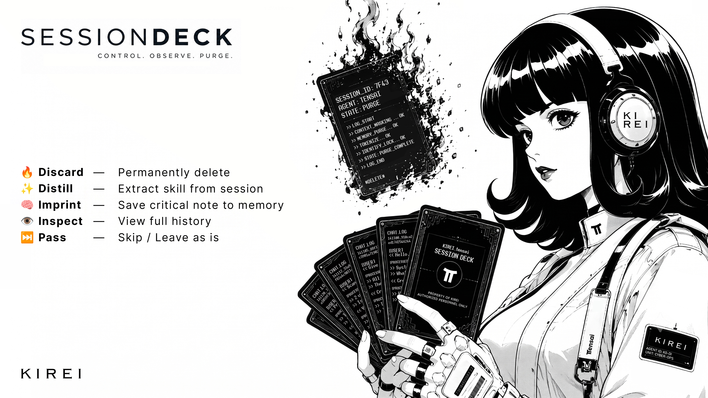

<p align="center">
  
</p>

# 🃏 Session Deck

> **Control. Observe. Purge.**

Turn forgotten Hermes sessions into a living deck of knowledge.

Session Deck transforms old Hermes conversations into an interactive deck of cards. Instead of letting past sessions become clutter, each card becomes a choice that helps your AI evolve.


---

## 🃏 Gameplay

```text
          Draw a Card
               │
   ┌───────────┼───────────┐
   │           │           │
   ▼           ▼           ▼

🔥 Discard  ✨ Distill  🧠 Imprint

       │
       ▼

👁️ Inspect

       │
       ▼

⏭️ Pass
```

---

## ✨ Features

| Action | Description |
|--------|-------------|
| 🔥 **Discard** | Permanently delete obsolete sessions and unwanted context. |
| ✨ **Distill** | Extract reusable workflows and convert them into Skills. |
| 🧠 **Imprint** | Save important decisions and long-term preferences into Memory. |
| 👁️ **Inspect** | Review the complete history before making a decision. |
| ⏭️ **Pass** | Skip the current card and revisit it later. |

---

## 💡 Why?

AI conversations are usually forgotten once they're over.

Session Deck treats conversations as assets instead of archives. Every session can become reusable knowledge, a permanent memory, or simply disappear when it no longer provides value.

Instead of collecting history forever, your AI continuously **curates**, **learns**, and **evolves**.

---

## 🚀 Installation

```bash
cp -r session-deck ~/.hermes/skills/automation/session-deck
```

Verify installation:

```bash
hermes skills list
```

---

## ▶️ Usage

```bash
python3 scripts/session_deck.py pick
```

Or simply tell your agent:

```text
Start Session Deck.

Draw a random card.

Wait for my decision.

Discard
Distill
Imprint
Inspect
Pass

Repeat.
```

---

## 📜 License

MIT

Use it. Fork it. Improve it.

---

<p align="center">

**Every conversation is a card.**  
**Every card is a decision.**

🃏

</p>
